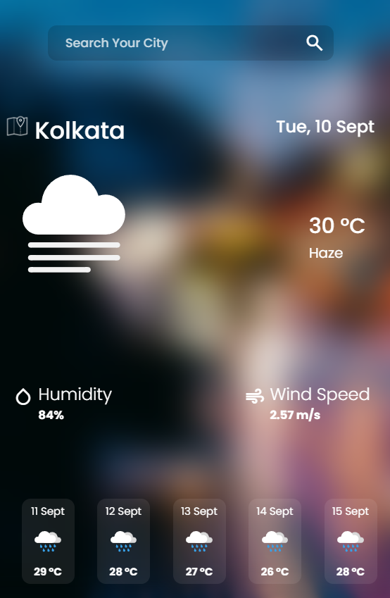
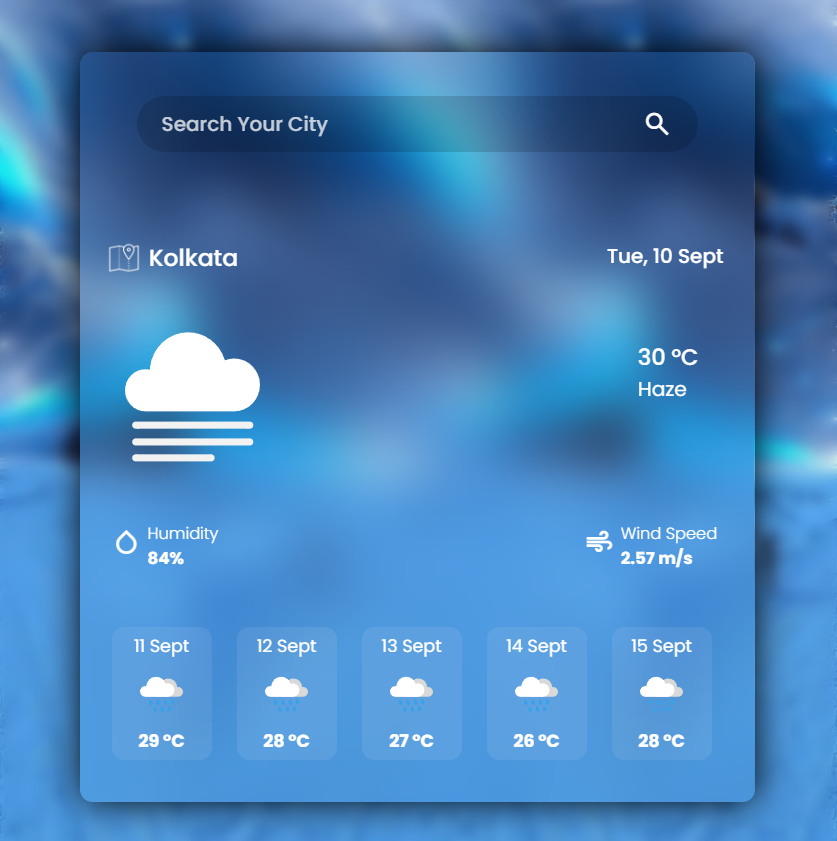

# ☀️ Weather App 🌦️

Welcome to the **Weather App**! This web application provides real-time weather updates for any location across the globe. With smooth transitions and responsive design, the Weather App adapts seamlessly to desktop, tablet, and mobile devices.

## 🚀 Features

- 🌍 **Real-time Weather Updates**: Get current weather conditions for any city.
- 📱 **Responsive Design**: Optimized for desktop, tablet, and mobile views.
- 🌡️ **Detailed Forecasts**: View temperature, humidity, wind speed, and more.
- 🔄 **Interactive UI**: Smooth animations and transitions for a clean and modern user experience.
- 🔍 **Location Search**: Quickly search for weather information by city or your device's GPS.

## 🎬 Animated Previews

### 🖥️ Desktop View


### 📱 Mobile View


### 📲 Tablet View


## 🎨 Technologies Used

- **HTML5**: Semantic structure for building the app layout.
- **CSS3**: Modern CSS features like Flexbox, Grid, and transitions for animations.
- **JavaScript (ES6+)**: Fetch API for dynamic weather data and user interactions.
- **OpenWeatherMap API**: Used for fetching real-time weather information.

## 🛠️ How to Use

1. **Clone the repository**:
   ```bash
   git clone https://github.com/sahinparvej2001/weather-app.git
